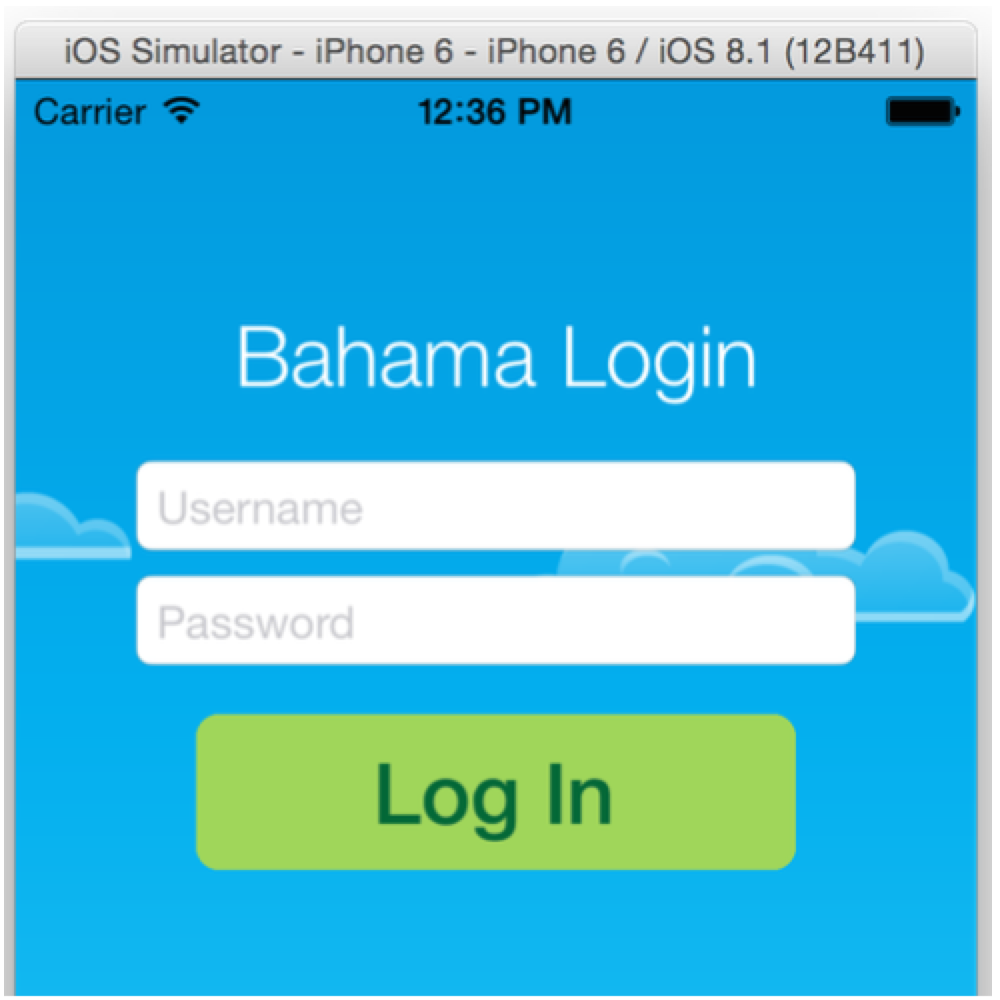
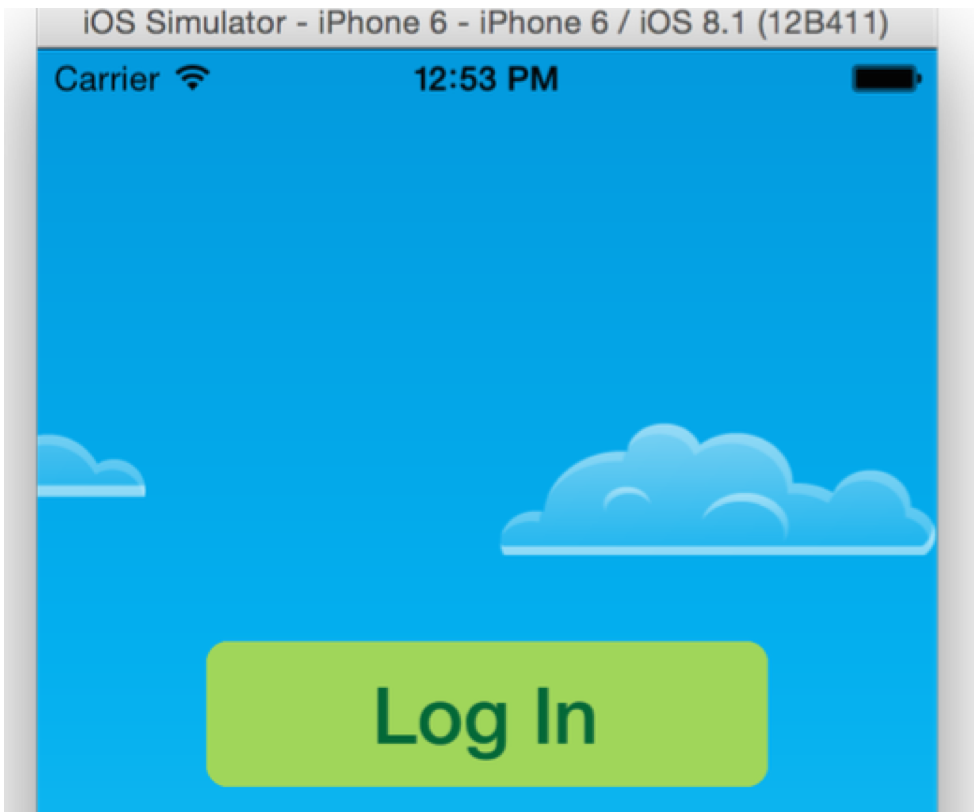
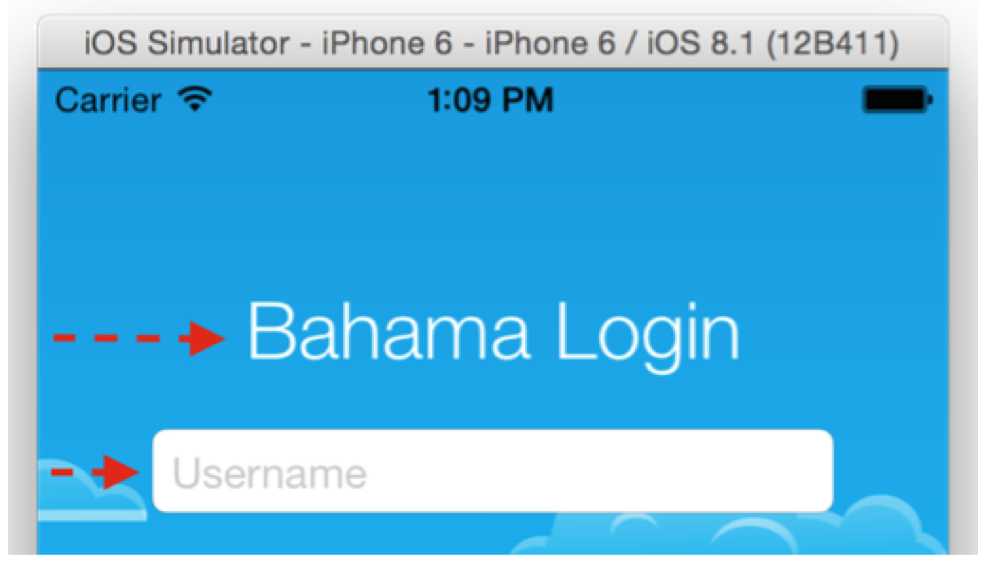
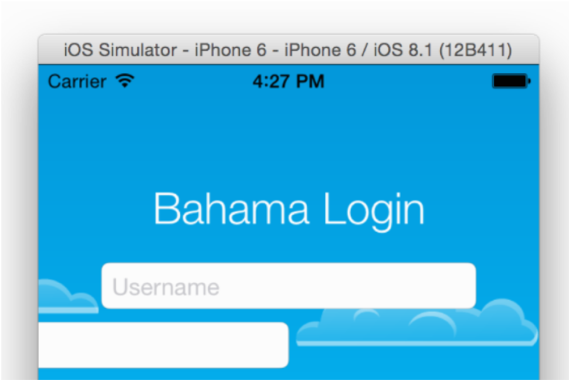

이 장에서는 애니메이션에 발을 담그게 됩니다.
하지만 제목에 현혹되지 마세요. 이렇게 강력하고 풍부한 APi로 시작하는 것은 다루어야 할 흥미로운 자료가 많다는 것을 의미합니다.

이 장및 관련 프로젝트에서 다음을 수행하는 방법에 대해 알아보겠습니다.

- 멋진 애니메이션을 위한 stage를 만련하세요
- 이동 및 fade Animation을 만듭니다.
- 애니메이션 완화 기능을 조정합니다.
- 애니메이션을 반전하고 반복합니다.

상당한 자료들이 있지만, 아주 재미있을 거라고 약속합니다. Are you up for the challenge?

# Your first animation

이 장의 리소스 폴더에 있는 시작 프로젝트를 여십시오. Xcode로 프로젝트를 만들고 실행하면 다음과 같은 가상의 항공사 앱의 로그인 화면이 나타납니다.



이 앱은 현재 별로 효과가 없습니다. 아래에 제목, 두 개의 텍슽 필드, 큰 친근한 버튼이 있는 로그인 양식만 표시됩니다.

배경 사진도 좋고 구름도 네 개 있습니다. 구름은 clound1 ~ cloud4 코드는 이미 연결 되어 있습니다.

ViewController.swift를 열고 내부를 확인하십시오. 파일 맨 위에 연결 된 모든 대상처와 클래스 변수가 표시됩니다. 또한 일부 UI를 초기화하는 View DidLoad()에 약간의 코드가 있습니다. 이 프로젝트는 여러분이 뛰어들어 상황을 조금 흔들어 볼 준비가 되어 있습니다!

소개를 충분히 해 보시기 바랍니다. 몇 가지 코드를 시험해 볼 준비가 되어 있다는 것은 의심의 여지가 없습니다!

첫 번째 작업은 사용자가 응용 프로그램을 열 때 화면 위에 양식 요소를 애니메이션화하는 것입니다. 이제 앱이 시작되면 양식이 표시되므로 view controller가 나타나기 바로 전에 화면 밖으로 옮겨야 합니다.

다음 코드를 viewWillAppear()에 추가 해 봅니다.

```swift
heading.center.x  -= view.bounds.width
username.center.x -= view.bounds.width
password.center.x -= view.bounds.width
```

이렇게 하면 각 양식 요소가 화면의 보이는 경계 밖에 배치됩니다.


위의 코드는 ViewController가 나타나기 전에 실행되므로, 이러한 텍스트 필드는 처음부터 없었던 것처럼 보입니다.

프로젝트를 작성하고 실행하여 필드가 계획한 대로 실제로 화면에 표시 되도록 합니다.



잘 되었습니다. 이제 즐거운 애니메이션을 통해 폼 요소를 원래 위치로 다시 애니메이션 할 수 있습니다.

다음 코드를 viewDidAppear() 끝에 추가합니다.

```swift
UIView.animate(withDuration: 0.5) {
  self.heading.center.x += self.view.bounds.width
}
```

제목을 애니메이션으로 표시하려면 UIView 클래스 메서드를 부릅니다.

animate(withDurationLAnimations:). 애니메이션이 즉식 시작되고 0,5초 이상 애니메이션됩니다. 코드의 첫 번째 메서드 매개 변수를 통해 지속 시간을 설정합니다.

이렇게 하면 매우 쉽습니다. 애니메이션 종료 시 보기에 대한 모든 변경 내용이 Uikit에 의해 애니메이션 됩니다.

프로젝트를 만들고 실행 합니다. 제목 스라이드가 다음과 같이 깔금하게 제자리에 표시되어야 합니다.


그러면 나머지 양식 요소에서 애니메이션을 실행 할 수 있습니다.

animation(withDuration:anmations:)는 class의 method이므로 특정 view하나만 애니메이션 할 수 있습니다.

다음 코드를 추가 합니다.
```swift
self.username.center.x += self.view.bounds.width
```
프로젝트를 빌드하고 다시 실행합니다. 사용자 이름 필드가 제대로 표시되는지 확인합니다.



두 가지 관전이 함께 애니메이션을 보는 것은 꽤 멋지지만, 두 개의 뷰를 동일한 거리에서 동일한 기간 동안 애니메이션하는 것은 다소 딱딱해 보입니다. 이렇게 완벽한 동기화로 킬봇만 이동합니다.

각 요소가 다른 요소들과 독립적으로 움직인다면 애니메이션 사이에 약간의 지연이 있었나?

먼저 방금 추가한 사용자 이름을 애니메이션하는 줄을 제거합니다.

```swift
self.username.center.x += self.view.bounds.width
```

그런 다음 아래에 코드를 viewDidAppear 및에 추가 합니다.

```swift
UIView.animate(withDuration: 0.5, delay: 0.3, options: [],
  animations: {
    self.username.center.x += self.view.bounds.width
  },
  completion: nil
)
```

이 시간에 사용하는 class method는 낯설지만 애니메이션을 사용자 지정 할 수 있는 몇 가지 매개 변수가 더 있습니다.

* withDuration: 애니메이션의 기간
* delay: UIkit이 애니메이션을 시작하기 전에 대기 할 시간(초)
* options: 애니메이션에 대한 여러 가지 측면을 사용자 정의 할 수 있습니다. 나중에 이 파라미터에 대해 자세히 알아보겠지만, 지금은 빈 []로 “특변한 옵션 없음”을 의미하는 것으로 전달 할 수 있습니다.
* animations: 클로져 표현식은 애니메이션을 표현합니다.
* completion: 애니메이션이 완료되면 실행됩니다. 이 파라미터는 종종 cleanup task?나 체인 형태로 차례로 수행하려는 경우에 종종 유용하게 사용 됩니다.

위에 추가한 코드에서 지연 시간을 0.3으로 설정하여 애니메이션이 제목 애니메이션보다 늦게 시작됩니다.

프로젝트를 만들고 실행합니다.


훨씬 나아 보이네요. 이제 암호 필드에 애니메이션만 하면 됩니다.

다음 코드를 뷰 하단에 추가합니다.

```swift
UIView.animate(withDuration: 0.5, delay: 0.4, options: [],
  animations: {
    self.password.center.x += self.view.bounds.width
  },
  completion: nil
)
```

여기서 사용자 이름 필드의 애니메이션을 가장하여 조금 더 지연시켰을 뿐입니다.

프로젝트를 만들고 다시 실행하여 전체 애니메이션 시퀀스를 확인합니다.


UIkit 애니메이션으로 화면 전체의 보기를 애니메이션화 하려면 이 모든 작업을 수행해야 합니다!

이것이 시작에 불과합니다. 이 장의 나머지 부분에서는 몇 가지 멋진 애니메이션 기술을 더 배울 것입니다!

Animatable properties

이제 애니메이션이 얼마나 쉬운지 알았으니 이제 여러분은 어떻게 다른 방식으로 자신의 관점을 애니메이션화 할 수 있는지 알고 싶을 것입니다.

이 세션에서는 UIView의 애니메이션 적용 가능한 특성에 대한 개요를 설명한 다음 프로젝트에서 이러한 애니메이션을 탐색하는 과정을 안내합니다.

모든 view의 프로퍼티를 애니메이션 할 수 있는 것은 아니지만 가장 간단한 것부터 가장 복잡한 것까지 모든 view가 아래의 설명 처럼 만들 수 있습니다.


이 전 장과 같이 view의 position과 frame을 애니메이션 하여 view가 확장, 축소 또는 이동되도록 할 수있습니다. 다음은 view의 postion과 frame을 수정하는데 사용하는 프로퍼티 입니다.

* bounds: 이 프로퍼티는 위치를 변경하는데 사용하는 속성입니다.
* frame: 이 프로퍼티는 view를 이동하거나 scale하는데 사용하는 속성입니다.
* center: 이 프로퍼티는 view를 새로운 위치에 이동 할 때 사용하는 속성입니다.

UIkit의 size와 center 프로퍼티는 크기와 변경 할 수 있습니다. 즉, center.y로 view를 수직으로 이동 시킬 수 있고 frame.size.with로  view를 줄여 들게 할 수 있습니다.


view의 background의 색과 반투명으로 설정하여 view의 content를 변경 할 수 있습니다.


- backgoundColor: 이 프로퍼티는 UIKit이 시간이 지나면서 서서히 배경 색을 변경하게 합니다.
- alpha: 이 속성을 변경하여 fade-in, fade-out 효과를 만듭니다.


위와 동일한 방법으로 크기 및 위치도 변경 할 수 있습니다.

- transform: 이 프로퍼티는 블록 내에서 view의 회전, 크기 그리고 위치를 변경 할 때 사용합니다.

These are affine transformations under the hood, which are much more powerful and allow you to describe the scale factor or rotation angle rather than needing to provide a specific bounds or center point.

이것들은 아주 기본적인 구성 요소처럼 보이지만, 당신은 복작한 애니메이션 효과를 보고 놀라 것입니다.

#Animation options

애니메이션 코드를 보면, 파라미터 option을 []으로 전달 했습니다.option을 사용하면 UIKit이 애니메이션을 생성하는 방법을 사용자가 정의 할 수 있습니다. 애니메이션의 지속 시간과 지연 시간만 조정했을 뿐 아니라 애니메이션 매개 변수를 훨씬 더 효과적으로 제어 할 수 있습니다.

아래의 옵션 리스트는 UIViewAnimationOptions의 type 입니다. 애니메이션에 사용하기 위해 다양한 방법으로 결합 할 수 있습니다.

Repeating

다음 두 가지 애니메이션 옵션을 먼저 살펴보겠습니다.

* .repeat: 이 옵션은 애니메이션을 무한 루프 만듭니다.
* .autoreverse: 이 옵션은 .repeat와 함께 포함합니다. 이 옵션은 반복적으로 애니메이션을 앞으로 재생한 다음 반대로 재생합니다.

password field의 viewDidAppear()에 .repeat 옵션을 수정합니다.

```swift
UIView.animate(withDuration: 0.5, delay: 0.4,
  options: [.repeat, .autoreverse],
  animations: {
    self.password.center.x += self.view.bounds.width
  },
  completion: nil
)
```

repeat효과를 볼려면 빌드를 해봅니다.



title field 과 username field만 화면 중간에 위치하지만 password field는 애니메이션이 영구적으로 됩니다.

위에서 변견한 것과 동이한 코드를 수정하여 옵션 파라미터 .repeat와 .autoreverse를 모두 사용합니다.

```swift
UIView.animate(withDuration: 0.5, delay: 0.4,
  options: [.repeat, .autoreverse],
  animations: {
    self.password.center.x += self.view.bounds.width
  },
  completion: nil
)
```

둘 이상의 옵션을 사용하려면 성정 구문을 사용하고 쉼표로 구분된 모든 옵션을 나열하고 몰록을 대괄호로 묶어야 하는 방법을 참고하세요.

Build and run your project again; this time the password field just can’t make up its mind about staying on the screen!

#Animation easing

현실에서 모든 것이 갑자기 시작되거나 멈추는 것은 아니다. 자동차나 기차와 같은 물리적 물체는 목표 속도에 도달 할 때까지 천천히 가속하며, 그들이 벽에 부딪히지 않는 한, 그들은 최종 목적지에서 완전히 멈출 때까지 서서히 속도를 늦춥니다.

아래 이미지는 이 개념을 자세히 보여줍니다.


애니메이션을 보다 사실적으로 보이도록 하기 위해 시작 시 가속도를 구축하고 끝 전에 느려지는 것과 도일한 효과를 적용 할 수 있습니다. 일반적으로 ‘case-in’ 및 ‘case-out’이라고 합니다.

다음과 같은 네 가지 완화 옵션 중에서 선택 할 수 있습니다.

- .curveLinear: 이 옵션은 애니메이션에 가속 또는 감속을 적용하지 않습ㄴ디ㅏ. 이 책에서 이 옵션을 사용 할 유일한 시간은 3장 ‘Transitions’의 마지막 challenge에서 입니다.
- .curveEaseIn: 이 옵션은 애니메이션 시작 부분에 가속을 적용 합니다.
- .curveEaseOut: 이 옵션은 애니메이션 끝에 감소을 적용합니다.
- .curveEaseInOut: 이 옵션은 애니메이션 시작 부분에 가속도를 적용하고 애니메이션 끝 부분에 감속을 적용합니다.

이러한 옵션이 어떻게 애니메이션에 시각적 영향을 미치는지 더 잘 이해하기 위해 프로젝트의 몇 가지 옵션을 시도해 볼 수 있습니다.

다음과 같은 새 옵션을 사용하여 password field의 애니메이션 코드를 다시 한 번 수정합니다.

```swift
UIView.animate(withDuration: 0.5, delay: 0.4,
  options: [.repeat, .autoreverse, .curveEaseOut],
  animations: {
    self.password.center.x += self.view.bounds.width
  },
  completion: nil
)
```

프로젝트를 만들고 실행합니다. 가장 오른쪽 위치에 도달 할 때가지 필드가 얼마나 부드럽게 감속하는지 확인한 후 화면 왼쪽으로 돌아갑니다.


이것은 여러분이 실제 세상에서 어떻게 움직이는지 예상하기 때문에 훨씬 더 자연스러워 보입니다.

이제 그 반대도 시도해 보세요. 위와 동일한 코드를 수정하여 .curveEaseOut 옵션을 다음과 같이 .curveEaseIn로 변경하여 필드가 여전히 화면 밖에서 있을 때 애니메이션을 쉽게 적용 할 수 있습니다.

```swift
UIView.animate(withDuration: 0.5, delay: 0.4,
  options: [.repeat, .autoreverse, .curveEaseIn],
  animations: {
    self.password.center.x += self.view.bounds.width
  },
  completion: nil
)
```

프로젝트를 만들고 실행하십시오. 어떻게 필드가 기계적인 힘으로 돌아가는 관찰 합니다. (?) 이것은 주자연 스러워 보이고 이전의 애니메이션 만큼 시각적으로 즐겁지 않습니다.

마지막으로 .curveEaseInOut을 사용해 보십시오. 그것은 당신이 이미 알고 있는 두 가지 옵션을 하나의 매우 자연스럽게 보이는 완화로 경합합니다. 또한 .curveEaseInOut은 당신의 애니메이션에 적용되는 기본 완화 기능입니다.

다양한 애니메이션 옵션이 프로젝트에 어떤 영향을 미치는지, 움직임의 매끄럽고 자연스럽게 보이는 방법을 살펴보았습니다.

다음 단계로 이동하기 전에 재생하고 있던 코드 조각의 옵션을 []로 변경합니다.

```swift
UIView.animate(withDuration: 0.5, delay: 0.4,
  options: [],
  animations: {
    self.password.center.x += self.view.bounds.width
  },
  completion: nil
)
```

이제 기본적인 애니메이션이 어떻게 작동하는지 알았으니 좀 더 눈부신 애니메이션 기법을 다룰 준비가 된 것입니다.

A지점에서 B지점으로 애니메이션을 만드는 것은 매우 쉽습니다!

다음 chapter에서는 spring을 사용하여 애니메이션을 구동하는 방법을 살펴보겠습니다.

 
