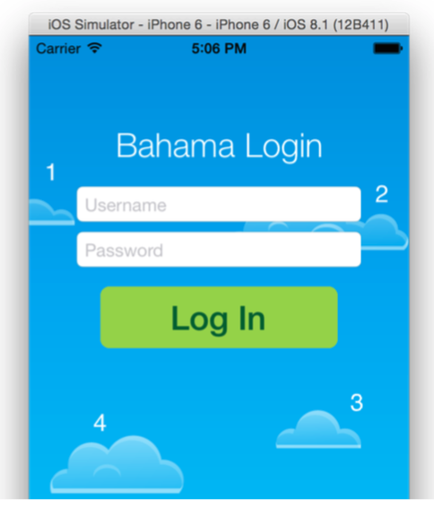

# chapter1 Challenges

# Challenges

이 장이 iOS에서 보기를 처음으로 애니메이션으로 만든 경우, 머리가 약간 회전 할 수 있습니다. 하지만 걱정하지 마세요, 여러분의 초기 기술이 무엇이든지 간에, 여러분은 단지 몇 장 만에 애니메이션에 숙달하는 길을 잘 갈 것이기 때문입니다.

하지만 현재로서는 아주 간단한 도전이 하나 있습니다.

# Challenge 1: Fade in the clouds

ViewController에는 cloud1, cloud2, cloud3, cloud4의 네가지 outlets을 가지고 있습니다. 작업은 application starts에서 이러한 작업을 희미하게 표시하는 것입니다.

솔루션의 정확한 형태에 대해 상당히 많이 결정 할 수 있지만, 다음과 같은 기존벅인 단계를 따라야 합니다.

1. ViewWillAppear()에서 네 개의 모든 cloud view에 대해 alpha 프로퍼티를 0.0으로 설정합니다.
2. ViewDidAppear()에서 animate(withDuration:delay:options:animations:completion:)를 개별로 실행하며 4개의 애니메이션 모두에 대해 0.5개의 재생 시간과 0.5, 0.7, 0.9, 1.1개의 지연 시간을 사용 할 경우 멋진 효과를 얻을 수 있습니다.
3. 각 애니메이션 closusre에서 각 cloud view의 alpha를 1.0으로 변경 합니다. 그러면 구름이 희미해집니다.

프로젝트를 실행 할 때 cloud를 애니메이션화하는 멋진 전환 효과를 차례로 확인해야 합니다.

화면의 모든 뷰는 잘 애니메이션 되어야 합니다. 거의 … 로그인 버튼이 활성화되지 않았습니다! 걱정하지마세요 그건 다음 장에서 고칠 겁니다.
