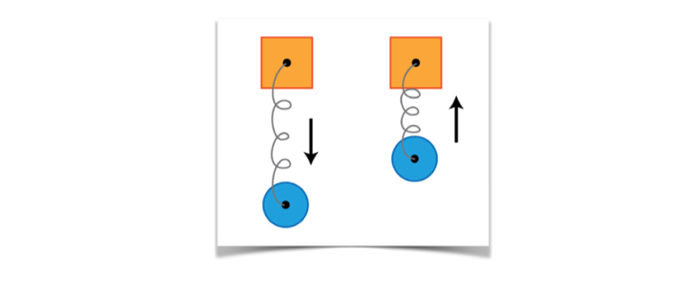

#Chapter2: Spring

앞 장에서는 UIkit으로 기본 애니메이션을 만드는 방법을 배웠습니다. 시작 및 종료 값을 기간, 지연 및 기타 옵션과 함께 제공함으로써 UIKit은 자동으로 애니메이션 만듭니다.

지금까지 애니메이션은 한 방향으로 유동적인 움직임이었습니다. view의 위치를 애니메이션화하면 다음과 같이 A 지점에서 B지점으로 쉽게 이동 할 수 있습니다.


이 chapter에서는 보다 복잡한 애니메이션을 만드는 방법을 알아보겠습니다. 이 애니메이션은 마치 뷰가 Spring에 연결된 것처럼 움직입니다.



기본 애니메이션을 A 지점에서 B지점ㅇ까지 가져다가 약간 흔들리면 애니메이션의 동작은 아래의 빨간색 화살표로 표시된 경로를 따릅니다.


View는 점 A에서 점 B로 연결되지만 점 B를 작은 양만큼 overshoot합니다. 그런 View가 다시 B 지점으로 돌아가 이번에는 야간 더 낮게 overshoot됩니다. 이 앞 뒤로의 진동은 View가 B지점에서 정지 할 때까지 반복됩니다.

그것은 멋진 효과입니다. 그것은 여러분의 애니메이션에 산뜻한 실제 느낌을 더합니다. 이장에서는 UI에 재생성을 추가하는데 이 효과를 사용하는 방법을 설명합니다.

#Spring animations

이전 장의 프로젝트를 계속 진행합니다. 1장의 연습(  challenge 과제 )을 완료하지 않은 경우 2장이 리소스 폴더에서 시작 프로젝트를 가져와 시작합니다.

프로젝트를 만들고 실행합니다. 다음과 같이 앱이 열리는 즉식 화면에서 보기를 볼 수 있습니다. ( 로그인 버튼 제외 )


작업은 이 화면의 마지막 non-animation 요소(로그인 버튼)를 관리하는 것입니다.

ViewController.swift를 열고 ViewWillAppear() 하단에 다음 코드를 추가합니다.

```swift
loginButton.center.y += 30.0
loginButton.alpha = 0.0
```

앞 장에서와 같이 버튼의 시작 위치를 y축에서 약간 낮게 설정하고 알파 값을 0으로 설정하여 보이지 않는 것으로 시작합니다.

이제 viewDidAppear()를 보고 다음 코드를 추가합니다.

```swift
UIView.animate(withDuration: 0.5, delay: 0.5,
usingSpringWithDamping: 0.5, initialSpringVelocity: 0.0, options: [],
animations: {
  self.loginButton.center.y -= 30.0
  self.loginButton.alpha = 1.0
}, completion: nil)
```

이 코드에는 두 가지 핵심 포인트가 있습니다.

첫째, 두 가지 다른 속성을 동시에 활성화했습니다! 생각보다 쉬웠죠?

둘째, 새 애니메이션 메소드를 처음으로 사용했습니다. animate(withDuration:delay:usingSpringWithDamping:initialSpringVelocity:optio ns:animations:completion:) 그 메소드 이름을 빨리 말하는 것은 혀를 다치게 할 수도 있습니다!

위의 방법은 이전 장에서 사용했던 방법과 매우 유사하지만, 몇 가지 새로운 변수들을 자랑합니다.

* usingSpringWithDamping: 애니메이션이 최종 상태에 가까워질 때 적용되는 damping 또는 감소량을 제어합니다. 이 파라미터는 0.0 ~ 1.0 사이의 값을 수용합니다. 0.0에 가까운 값은 bouncier animation을 생성하는 반면 1.0에 가까운 값은 뻣뻣하게 보이는 효과를 만듭니다. 이 값은 스프링의 ‘stiffness’으로 생각 할 수 있습니다.
* initialSpringVelocity: 이것은 애니메이션의 초기 속도를 제어합니다. 1.0의 값은 애니메이션의 속도를 1초 동안 총 애니메이션 거리를 커버하도록 설정합니다. 값이 크고 작을수록 애니메이션의 속도가 더 높거나 낮아집니다.

프로젝트를 만들고 실행하십시오. 이제 button의 이동 방법을 확인하십시오


애니메이션 초기 속도가 0.0이고 neural damping은 0.5이므로 애니메이션이 눈길을 끌지 못합니다.

속도와 damping에 대해 몇 가지 다른 값을 시도하면 이 애니메이션을 약간 장식 할 수 있습니다.

지속 시간을 3.0으로, damping을 0.1로 변경합니다. 이것은 단지 당신이 정상적인 속도 대신에 느린 동작으로 당신의 변화의 영향을 관찰 할 수 있습니다.

프로젝트를 빌드하고 다시 실행하세요. button의 불투명도가 올라 갈 때 어떻게 변하는지 기록해 두세요. 그 이유는 스프링 동작은 애니메이션화되는 모든 속성에 영향을 주기 때문입니다. 이 동작은 버튼의 수직 위치와 alpha 값에 모두 영향을 미칩니다.

이제 initalSrpingVelocity를 1.0으로 설정하고 프로젝트를 빌드하고 다시 실행하세요.


버튼이 애니메이션화되거나 암호 필드를 벗어나면 버튼이 약간 더 튀어 오른다는 것을 알 수 있습니다. 이는 버튼의 이동 시작 부분에서 탄력이 더 커지고 최종 위치에 고정되는 데 더 오래 걸리기 때문이빈다.

이러한 매개 변수의 변화가 애니메이션의 모양과 느낌에 어떤 영향을 미치는지 이해 할 때까지 damping 및 속도에 대한 몇 가지 다른 값을 사용하여 재생하세요.

완료되면 속도 값을 다시 원래 값으로 설정하세요.

```swift
UIView.animate(withDuration: 0.5, delay: 0.5, usingSpringWithDamping:
0.5, initialSpringVelocity: 0.0, options: [], animations: {
  self.loginButton.center.y -= 30.0
  self.loginButton.alpha = 1.0
}, completion: nil)
```

#Animating user interactions

스프링 애니메이션을 보기 초기 배치로 제한 할 필요는 없습니다. 실제로 사용자 입력에 대한 응답으로 view를 애니메이션하면 인터페이스가 활성화 될 수 있습니다. 이섹션에서는 탭을 눌러 로그인 버튼을 애니메이션 합니다.

login()함수에 다음 코드를 추가합니다.

```swift
UIView.animate(withDuration: 1.5, delay: 0.0, usingSpringWithDamping:
0.2, initialSpringVelocity: 0.0, options: [], animations: {
  self.loginButton.bounds.size.width += 80.0
}, completion: nil)
```

위의 애니메이션은 button 너비를 1초 반 동안 80point 씩 증가시킵니다. damping이 0.2로 설정되었기 때문에 버튼이 상당히 튕겨집니다. 경계를 늘리면 왼쪽과 오른쪽의 frame이 커집니다.

프로젝트를 만들고 실행하세요. 애니메이션이 작동하는 것을 보려면 버튼을 누르세요.


버튼을 누르면 버튼이 커지며 깜박이는 방식으로 깜박입니다. 사용자에게 탭 피드백을 제공하는 깔끔한 방법입니다.

이제 이 애니메이션과 몇 가지 더 많은 스프링 동작을 결합하여 버튼을 실제로 사용 할 수 있습니다.

다음 코드를 login()함수에 추가합니다.

```Swift
UIView.animate(withDuration: 0.33, delay: 0.0, usingSpringWithDamping:
0.7, initialSpringVelocity: 0.0, options: [], animations: {
  self.loginButton.center.y += 60.0
}, completion: nil)
```


정말 멋지네요. 하지만 여러분은 곧 애니메이션 마스터가 되고 있고 훨씬 더 잘 할 수 있다는 것을 알고 있습니다.

사용자 피드백을 제공하는 또 다른 좋은 방법은 색상 변경을 통해서이다. 버튼의 배경색 속성을 애니메이션하여 버튼을 움직이는 동안 색칠합니다.

애니메이션 종료 식 안에 마지막으로 추가한 애니메이션에 다음 코드를 추가합니다.

```swift
self.loginButton.backgroundColor =
UIColor(red: 0.85, green: 0.83, blue: 0.45, alpha: 1.0)
```

프로젝트를 만들고 다시 실행하세요. 버튼 이동, 모양 변경 및 색 변경이 동시에 표시됩니다.


마지막으로 추가해야 할 피드백은 activity indicator 입니다. 로그인 버튼은 네트워크를 통해 사용자 인증을 시작하도록 되어 있으므로 activity indicator를 사용자에게 표시하여 진행 중인 작업이 있음을 알리는 것이 좋습니다.

스크롤를 위로 올려 viewDidLoad()에서 progress indicator를 찾습니다. UIacitivityIndicatorView에서 spinner가 포함되어 있어 사용 할 수 있습니다. 하지막 아직 볼 수 없습니다. 왜냐하면 alpha 값이 0.0으로 되어 있기 때문입니다.

login()함수로 돌아가서 다음 코드를 마지막 애니메이션 종료 식에 추가 합니다.

```swift
self.spinner.center = CGPoint(
  x: 40.0,
  y: self.loginButton.frame.size.height/2
)
self.spinner.alpha = 1.0
```

이 spinner 애니메이션은 왼쪽으로 약간 움직이며 서서히 사라집니다. 이것은 사용자의 주의를 끌고 그들의 요청이 처리되고 있다는 것을 그들에게 충분히 알릴 수 있어야 합니다.

프로젝트를 만들고 실행하세요. 최신 애니메이션의 최종 버전을 확인하세요.


잠시 시간을 내어 당신이 여기서 무엇을 성취했는지 생각해 보세요. 버튼 뷰에 3개의 동시 애니메이션을 추가하여 너비를 높이고 view를 아래로 이동하며 색상을 변경 할 수 있습니다.

또한 activity spinner에서 생기거나 희미하게 보이는 것도 button view의 하위 뷰이기 때문입니다.

모든 애니메이션은 UIKit에 의해 자동으로 결합되고 무결접 실행이 되어 하나의 유연한 시각 효과를 만듭니다.

애니메이션의 구현 세부 사항에 대해 걱정 할 필요가 없습니다. 대신 UIKit 덕분에 멋진 애니메이션을 디자인하고 사용자를 괴롭힐 수 있습니다.
