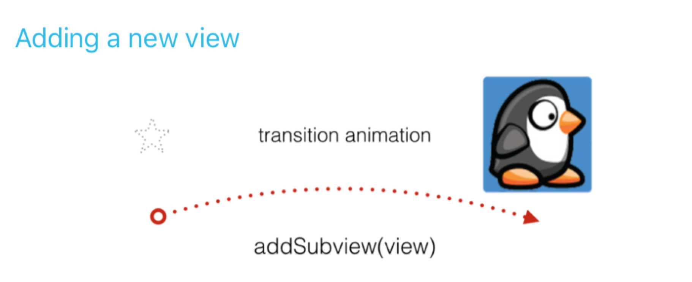
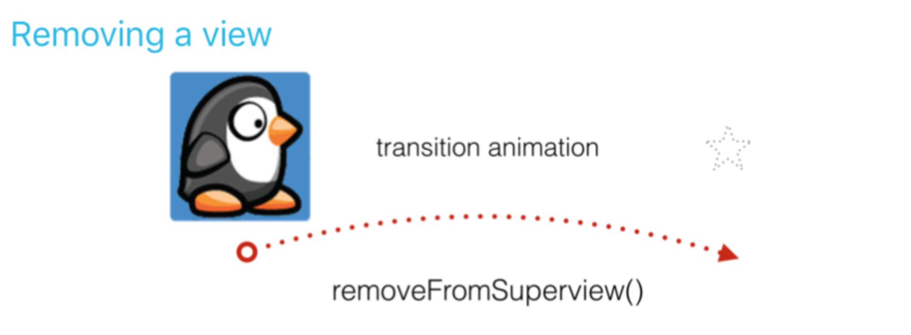
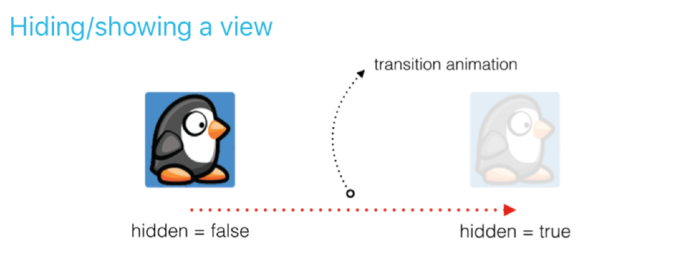
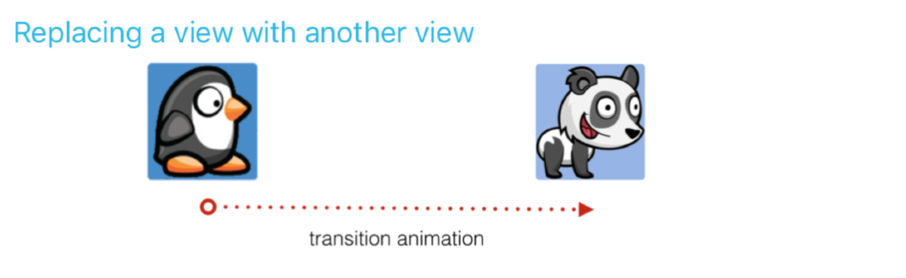
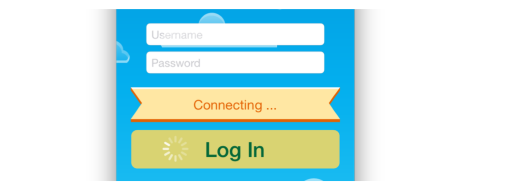
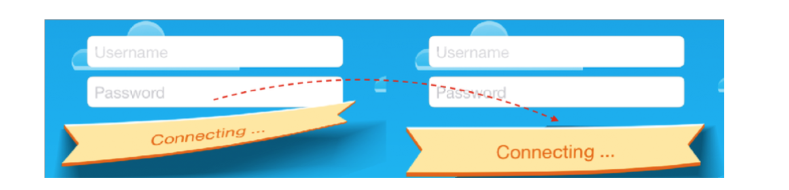
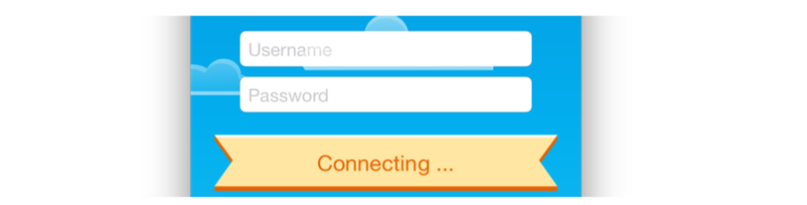
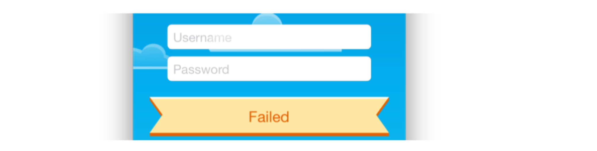

# Chapter 3: Transitions (전환)

이 전 두 장에서 위치 및 alpha와 같은 View의 애니메이션 적용 가능한 프로퍼티를 기반으로 애니메이션을 만드는 방법을 배웠습니다. 하지만 View 추가 또는 제거를 애니메이션화 할 경우 어떻게 처리하시겠습니까?

이 전 장의 방법을 사용하고 인터페이스를 안팎으로 View를 애니메이션 할 수 있습니다. 그러나 이 장에서는 전환을 사용하여 View의 변경 사항을 애니메이션화하는 방법을 설명합니다.

변환은 보기에 적용 할 수 있는 미리 정의 된 애니메이션입니다. 이러한 미리 정의 된 애니메이션은 보기의 시작 상태와 종료 상태 사이를 보관하지 않습니다. 대신 다양한 상태 변화가 자연스럽게 보이도록 애니메이션을 디자인 할 수 있습니다.

# Example transitions

전환 사용 시기를 더 잘 이해하기 위해 이 섹션에서는 전환 애니메이션을 사용 할 수 있는 다양한 애니메이션 시나리오를 안내합니다.



화면에서 새 View를 추가하려면 이전 장에서 사용한 것과 유사한 메서드를 호출합니다. 이번에는 미리 정의된 전환 효과 중 하나를 선택하고 애니메이션 contain View라고 하는 것을 애니메이션으로 만들 것입니다.

변환은 contain View를 애니메이션화하고 애니메ㅣ션이 실행 되는 동안 하위 View로 추가하는 모든 새 View가 나타납니다.

Contain View를 애니메이션화하는 방법과 하위 View 간 전환을 실행 할 시기를 더 잘 설명하려면 다음 코드 조각들을 고려하세요.

``` swift  
var animationContainerView: UIView!
override func viewDidLoad() {
  super.viewDidLoad()
  //set up the animation container
  animationContainerView = UIView(frame: view.bounds)
  animationContainerView.frame = view.bounds
  view.addSubview(animationContainerView)
}
override func viewDidAppear(_ animated: Bool) {
  super.viewDidAppear(animated)
  //create new view
  let newView = UIImageView(image: UIImage(named: "banner"))
  newView.center = animationContainerView.center
  //add the new view via transition
  UIView.transition(with: animationContainerView,
    duration: 0.33,
    options: [.curveEaseOut, .transitionFlipFromBottom],
    animations: {
      self.animationContainerView.addSubview(newView)
    },
    completion: nil
  )
}
```

이러한 가상 상황에서는 ViewController의 ViewDidload()에 animationContainView라는 새 View를 작성합니다. 그런 다음 이 Container를 배치하고 View에 추가합니다.

나중에 애니메이션 전환을 만들려면 애니메이션을 위한 새 View를 만듭니다. 여기서 newView라고 합니다.

전환을 생성하려면 transition(with: _ duration: _ options: _ animations: _ completion: _ ) 기존 UIView animation 방법과 거의 동일하지만 이 경우 전환 애니메이션의 ContainerVIew 역할을 하는 추가 매개변수가 View를 제공합니다.

여기서 새로운 애니메이션 옵션이 있습니다. .transitionFlipFormBottom입니다. 아직 보지는 못했지만, 이 것은 이 장의 도입에서 논의되는 미리 정의된 전환 중 하나입니다. .transitionFlifFromBottom은 뷰의 하단 가장자리가 View Flip?으로 사용되는 뷰를 Flip이라고 합니다.
(
There’s a new animation option here, .transitionFlipFromBottom, which you haven’t seen yet. This is one of the predefined transitions discussed in the introduction of this chapter. .transitionFlipFromBottom flips the view over with the bottom edge of the view serving as the “hinge” around which the view flips.
)

마지막으로 애니메이션 클로져 내의 애니메이션에 하위 View를 추가하면 전환 중에 하위 View가 나타납니다.

사전 정의된 전환 애니메이션 옵션의 전체 목록은 다음과 같습니다.

* .transitionFlipFromLeft
* .transitionFlipFromRight
* .transitionCurlUp
* .transitionCurlDown
* .transitionCrossDission
* .transitionFlipFromtop
* .transitionFlipFromBottom



transition animation으로 화면에서 하위 View를 제거하는 것은 하위 View를 추가하는 것과 같습니다. transition animation으로 이 작업을 수행하려면 애니메이션 종료 식 내에서 다음과 같이 간단히 removewFromSuperview()라고 하면 됩니다.

``` swift
//remove the view via transition
UIView.transition(with: animationContainerView, duration: 0.33,
  options: [.curveEaseOut, .transitionFlipFromBottom],
  animations: {
    self.newView.removeFromSuperview()
  },
  completion: nil
)
```

이전 예에서와 같이 래퍼 변환은 Flip animation을 수행하며 새 View가 모두 끝나면 사라집니다.



지금까지 View 계층을 변경하는 Transition에 대해서만 배웠습니다. 따라서 Transition 시 Container View가 필요했습니다. 즉, 계층 변경이 context에 적용됩니다.

반대로 숨겨서 표시 할 Container View를 설정 할 필요가 없습니다. 이 경우 Transition은 View 자체를 animation Container로 사용합니다.

Transition을 사용하여 하위 View를 숨기려면 다음 코드를 고려하세요.

``` swift
//hide the view via transition
UIView.transition(with: self.newView, duration: 0.33,
  options: [.curveEaseOut, .transitionFlipFromBottom],
  animations: {
    self.newView.isHidden = true
  },
  completion: nil
)
```

여기서 Transition의 첫 번째 인수로 표시하거나 숨기려는 View를 전달 합니다. 그런 다음 애니메이션 블록과 음성에서 View의 IsHidden 속성을 설정하면 Transition 애니메이션이 시작됩니다.



한 View를 다른 View로 교체하는 것도 쉬운 방법입니다. 기존 View를 첫 번째 인수로 전달하고 toView: 매개변수를 아래와 같이 교체하려는 View로 설정합니다.

``` swift
//replace via transition
UIView.transition(from: oldView, to: newView, duration: 0.33,
  options: .transitionFlipFromTop, completion: nil)
```

UIkit이 여러분에게 얼마나 많은 도움을 주는지 꽤 명확해지고 있습니다.

이 장의 나머지 부분에서는 Transition을 통해 UI 요소를 표시하고 숨기고 자신의 프로젝트에 가져 올 수 있는 몇 가지 새로운 애니메이션 기술을 배웁니다.

Mixing in transitions

이 장에서 Bagama Air login screen project 작업을 계속 할 것입니다. 이미 로그인 양식에 스피너를 추가하고 버튼을 누르기 위해 이 화면의 View에 많은 매력적인 애니메이션을 만들었습니다.

그런 다음 사용자 인증을 시뮬레이션하고 여러 가지 진행 상황 메시지를 애니메이션화합니다. 로그인 버튼을 누르면 ‘연결…’, ‘인증…’, ‘실패’등의 메시지가 표시됩니다.



이전 장을 수행하지 않은 경우 이 장의 리소스 폴더에서 시작 프로젝트로 시작 할 수 있습니다. 만약 여러분이 자신의 프로젝트에서 마지막 몇 장의 예를 따른다면, 아주 잘 한 일입니다. 기존 프로젝트로 계속  할 수도 있습니다.

ViewController.swift를 열고 ViewDidLoad()를 확인합니다. 이 방법의 일부는 클래스 변수 상태에 저장된 hidden image view를 추가합니다.

status를 사용하여 사용자에게 진행 메시지를 표시합니다. 메시지는 시작 프로젝트에 포함된 또 다른 클래스 변수인 메시지 배열에서 전송됩니다.

다음 메소드를 ViewController에 추가합니다.

``` swift
func showMessage(index: Int) {
  label.text = messages[index]
  UIView.transition(with: status, duration: 0.33,
    options: [.curveEaseOut, .transitionCurlDown],
    animations: {
      self.status.isHidden = false
    },
    completion: {_ in
      //transition completion
    } )
}
```

이 method는 인텍스라는 매개 변수를 사용하며, 이 매개 변수는 인텍스를 기준으로 레이블 값을 메시지 내용에 설정하는 데 사용됩니다.

다음으로 transition(with:duration:options:animations: completion:) 을 호출합니다. 배너를 설정한 상태로 표시하기 위해 애니메이션 블록 내에서 배너를 false으로 숨깁니다.

위의 또 다른 새로운 애니메이션 옵션이 있습니다. .transitionCurlDown. 이러한 transition은 종이가 법률용 패드에서 뒤집혀지는 것처럼 View를 애니메이션화하며 다음과 같습니다.



새로운 showMessage(index:) 메소드를 연습 할 때 입니다. login()에서 다음 코드를 찾습니다.

``` swift
animations: {
  self.loginButton.bounds.size.width += 80.0
}, completion: nil)
```

기존 애니메이션 블록으로 사용자가 탭 할 때 로그인 단추가 되돌아 갑니다. 이 애니메이션에 message(index:)를 표시하는 새로운 conpletion closure를 추가합니다.

완료의 nil 인수 값을 다음 closure로 바꿉니다.

``` swift
completion: { _ in
  self.showMessage(index: 0)
}
```

닫기는 하나의 bool파라미터 변수를 사용합니다. 이 매개 변수는 애니메이션이 성공적 완료되었는지 아니면 애니메이션이 완료되기 전에 취소되었는지 나타냅니다.

closure 내에서 단순히 showMessage with index 0을 호출하여 메시지 배열의 첫 번째 메시지를 표시합니다.

프로젝트를 만들고 실행하십세요. 로그인 버튼을 누르면 상태 배너가 첫 번째 진행 메시지와 함께 나타납니다.



그 현수막이 종이처럼 휘어지는 거 봤나요? 이것은 보통 정적 텍스트 레이블로 표시되는 메시지에 주의를 기울이는 매우 좋은 방법입니다.

다음 애니메이션의 경우 다음 배너를 올바른 위치에 배치 할 수 있도록 먼저 배너의 초기 위치를 저장해야 합니다.

다음 코드를 ViewDidLoad 끝 부분에 추가하여 배너 초기 위치를 statusPosition이라는 속성에 저장합니다.

``` swift
 statusPosition = status.center
```

이제 View animation transition의 혼합을 구상 할 수 있습니다.

다음 메소드를 추가 하여 표준으로 화면에서 status message를 제거합니다.

``` swift
func removeMessage(index: Int) {
  UIView.animate(withDuration: 0.33, delay: 0.0, options: [],
    animations: {
      self.status.center.x += self.view.frame.size.width
    },
    completion: { _ in
      self.status.isHidden = true
      self.status.center = self.statusPosition
      self.showMessage(index: index+1)
    }
) }
```

위의 코드에서 당신은 오랜 된 것을 사용합니다.

``` swift
animate(withDuration:delay:options:animations:completion:)을 사용하여 화면 바로 바깥으로 status를 이동합니다.
```

complete에서 애니메이션이 완료되면 status를 원래 위치로 다시 이동하고 숨깁니다. 마지막으로 showMessage에 다시 transition하지만, 이번에는 표시 할 메시지의 색을 전달 합니다.

표준 애니메이션을 전환과 결합하는 것은 매우 쉽습니다. 단순히 적절한 PAI를 호출하고 UIKIT은 배그라운드에서 해당 CoreAnimation 비트를 호출합니다.

이제 showMessage와 removeMessage 사이의 통화 체인을 완료하여 실제 인증 프로세스를 모방해야 합니다.

showMessage(index:)를 찾아 주석 // transition completion을 다음 코드로 바꿉니다.

``` swift
delay(2.0) {
  if index < self.messages.count-1 {
    self.removeMessage(index: index)
  } else {
  //reset form
  }
}
```

transition이 완료되면 2.0초 동안 기다렸다가 남아 있는 메시지가 있는지 확인합니다. 이 경우 removeMessage(index:)를 통해 현재 메시지를 제거합니다. 그런 다음 removeMessage(index:)의 compleste 블록에서 showMessage(index:)를 호출하여 다음 메시지를 순서대로 표시합니다.

프로젝트를 한 번 더 작성하고 실행하세요. 이렇게 인증 진행 메시지가 업데이트로 되는 애니메이션 시퀀스를 즐기세요.



Transition은 3D 스타일 애니메이션을 UIKIT에서 만드는 유일한 방법이기 때문에 비유적인 도구 상자에서 보관하기 위한 작지만 중요한 애니메이션 지식의 집합입니다.

보다 정교한 3D 효과를 알고 싶으시다면 VI섹션 “3D 애니메이션”에서 핵심 애니메이션과 3D layer Transitin을 자세히 설명 할 수 있는 기회를 드립니다.

다음 섹션으로 이동하기 전에 이 장의 과제를 시도해 보세요. 지난 세 장에서 애니메이션에 대해ㅔ 많은 것을 배웠기 때문에, 한 가지 도전은 충분하지 않습니다. 저는 여러분에게 세가지를 주었습니다.

이러한 과제를 통해 Bahama Air login Screen에서 개발을 마뤼 하고 첫 번째  über haxx0r 과제를 수행 할 수 있습니다.
