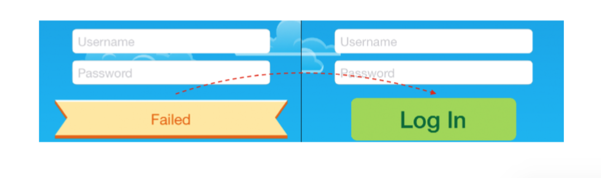

# Chapter 3: Challenges

Challenge 1: Pick your favorite transition

지금까지 내장된 전환 애니메이션 중 하나만 보셨을 것입니다. 다른 사람들이 어떻게 생겼는지 궁금하지 않아요?

이 과제에서는 사용 가능한 다른 transition 애니메이션을 모두 시도해보고 즐겨찾기를 사용하여 진행 메시지 배너를 애니메이션 할 수 있습니다.

ViewController를 열고 message(index:)에서 transition 애니메이션 .transitionCurlDown 구체적으로 명시 하세요.

``` swift
UIView.transitionWithView(status, duration: 0.33, options:
  [.curveEaseOut, .transitionCurlDown], animations: ...
```

.transitionCurlDown을 사용 가능한 다른 transition 애니메이션으로 교체한 다음 프로젝트를 빌드하고 실행하여 애니메이션의 모양을 확인합니다. 다음은 사용 가능한 transition 목록입니다.

``` swift
.transitionFlipFromLeft
.transitionFlipFromRight
.transitionCurlUp
.transitionCurlDown
.transitionCrossDissolve
.transitionFlipFromTop
.transitionFlipFromBottom
```

이 화면의 다른 애니메이션과 가장 잘 맞는 것은 무엇이라고 생각하십니까?

즐겨 찾는 것이 없다면 내가 가장 좋아하는 .transitionFlipFromBottom을 사용보세요. 배너 그래픽과 잘 맞는 것 입니다.


Challenge 2: Reset the form to its initial state

이 문제를 해결하려면 로그인 단추를 누른 후 실행 되는 모든 애니메이션을 실행 취소하여 양식을 초기 상태로 재설정합니다. 이렇게 하면 로그인에 실패하면 로그인 단추를 두 번쨰로 누르면 모든 애니메이션이 다시 발생하는 것을 볼 수 있습니다.

다음은 이 과제를 완료하는 데 필요한 일반적인 단계 목록입니다.

1. 빈 메서드 resetForm()을 새로 만들고 자리 표시자 설명이 있는 코드에서 호출합니다.
2. resetForm()에서 transition(with: _ duration: _ option: _ animations: _ completion: _)을 사용하여 상태 가시성을 hidden으로 설정하고 중심을 self.statusPosition으로 설정합니다. 이렇게 하면 배너가 초기 상태로 재설정됩니다. 해당 전환에서 대해 0.2초 기간을 사용합니다.
3. 당신의 배너를 숨기는 전환은 배너를 보여주는 애니메이션의 정반대 애니메이션을 사용하는 것이 좋을 것입니다. 예를 들어 .transitionCurlDown을 통해 배너르 ㄹ표시하는 경우 .transitionCulrUp을 사용하여 배너를 숨깁니다. .transitionFlipFormBottom의 역방향은 transitionFlipFromTop …등이 될 것입니다.
4. 그런 다음 animate(withDuration: _ delay: _ options: _ animations: _ completion: _ )의 resetForm()을 내부에서 만듭니다.
    * loginButton의 indicator를 self.spinner를 원래 위치 (-20.0, 16.9)로 이동합니다.
    * self.spinner의 알파 속성을 0.0으로 설정하여 숨깁니다.
    * 로그인 버튼의 배경색을 원래 값으로 다시 색칠합니다.( UIColor( red: 0.63, green: 0.84, blue: 0.35, alpha: 1.0)
    * 계속해서 로그인 버튼에 대한 모든 변경 사항을 bounds.size.width의 속성을 80으로 감소시킵니다.
    * 마지막으로 버튼을 비밀번호 필드 아래의 원래 지점으로 다시 이동시키고 center.y를 60.0으로 감소 시킵니다.

인증 프로세스에서 모든 애니메이션을 정확하게 반전시킨 경우 모든 인증 메시지가 표시되면 다음과 같이 애니메이션해야 합니다.


