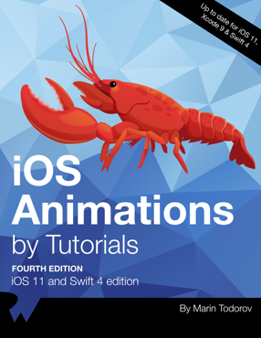

# iOS-Animation

iOS 애니메이션 시작합니다.

------

## 책 소개

- [iOS Animations by Tutorials](https://store.raywenderlich.com/products/ios-animations-by-tutorials)

  - Platform : iOS 11
  - Laguage: Swift 4
  - Tool: Xcode 9

## Chapter 소개
---

|  
Chapter
 |  
 제목 
 |  
 비고 
 | 블로그 링크 |
|:--------|:--------:|--------:|--------:|
|
 **ch1** 
 | 
 [Getting Started with View Animations](./Chapter/ch1) 
 | 작성 중 | [링크](http://linsaeng.tistory.com/12)
|
 **ch2** 
| 
 Spring 
 | 제작 중 |
|
 **ch3** 
| 
 Transitions 
 | 제작 중 |
